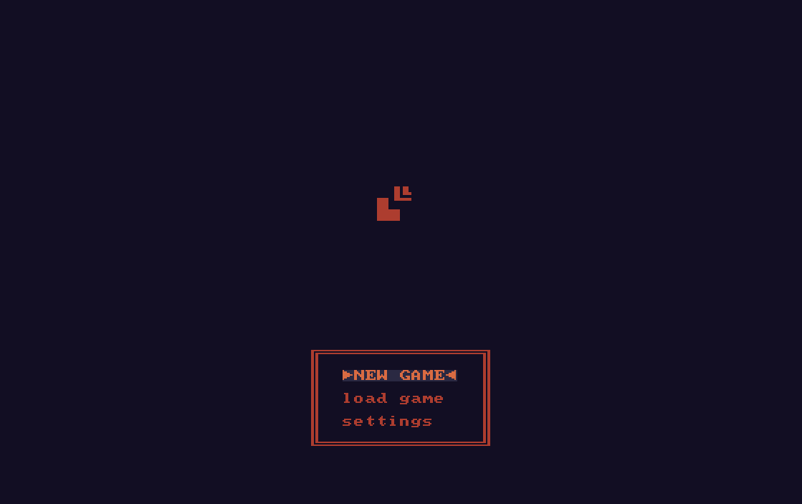

# RPG Game
###### A pretty good attempt at trying to make a game

This rpg game that is about leveling your characters through fun and meaningful quests as well as interesting 
skills. These will be repetitive but fun and rewarding tasks everywhere throughout the game. Remember this is progress
to leveling your character to the max to "complete the game".

## Screenshots

## Technical Details
- 2d 
- semi procedural in special areas
- fabricated and fleshed out maps with many items to pick up

## Gameplay Details
- No classes, design your own stat balance to create unique builds.
- Deep crafting that provides improved tools and weapons if you have the right materials.
- Dungeons with procedural generation for replayability and continuous progress.
- Permadeath - an ode to roguelikes you die, you restart.

## Play the Game
Go over to the releases tab and download the executable for your OS.
If your's is not listed, please message me and I will assist you.

## Controls
- move around with WASD or arrow keys
- bumping into things will auto perform actions (i.e. fishing, attacking)
- p - **p**ick up items

